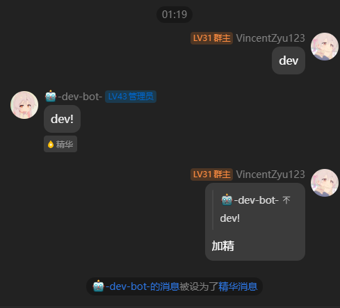

# koishi-plugin-set-essence-message

[](https://www.npmjs.com/package/koishi-plugin-set-essence-message)

让一般路过普通群员也能设置精华消息

## ⚠️ 平台限制

**仅支持 OneBot 适配器**（如 go-cqhttp、Lagrange.OneBot 等）

本插件依赖 OneBot 协议的精华消息 API，其他平台适配器暂不支持。

## 功能

- **加精** - 将引用的消息设置为精华消息
- **去精** - 取消引用消息的精华状态

## 预览



## 使用方法

### 命令

```
加精    # 引用一条消息后发送此命令
去精    # 引用一条消息后发送此命令
```

### 示例

```
用户A: [发送了一条重要消息]
你: [引用该消息] 加精
机器人: ✓ 已将该消息设为精华

你: [引用精华消息] 去精
机器人: ✓ 已取消该消息的精华状态
```

## 权限说明

默认情况下，任何群成员都可以使用这两个命令。如需限制权限，请配合 Koishi 的权限系统配置。

## 技术实现

本插件通过调用 OneBot 适配器的以下方法实现：
- `session.onebot.setEssenceMsg()` - 设置精华消息
- `session.onebot.deleteEssenceMsg()` - 删除精华消息

详见 [OneBot 适配器源代码](https://github.com/koishijs/koishi-plugin-adapter-onebot)
或者 [LLBot ApiFox文档](https://api.luckylillia.com/api-227234474)
或者 [Napcat ApiFox文档](https://napcat.apifox.cn/226658674e0)